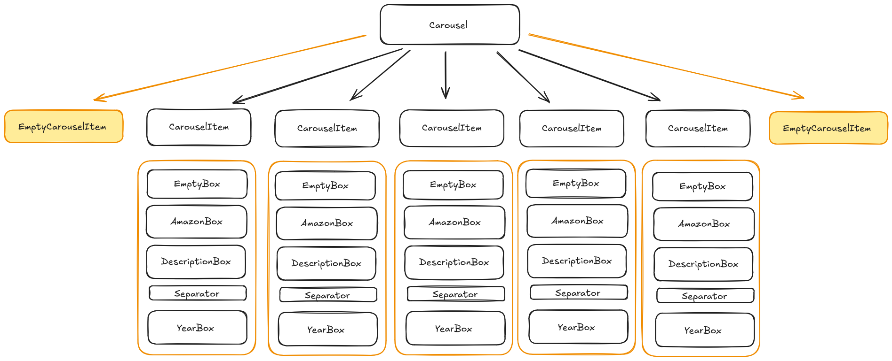

# Responsive Timeline Carousel

> A responsive timeline carousel that adjusts based on screen size, built using React. This project behaves like a carousel, where the central item is always active, and skeleton placeholders ensure smooth interaction across different screen sizes.

## Summary

- [Introduction](#introduction)
- [Technologies](#technologies)
- [Installation](#installation)
- [Usage](#usage)
- [Fonts](#fonts)
- [Custom Hook](#customhook)

## Introduction

This project is a **responsive carousel** that functions as a **timeline**. It is optimized for mobile, tablet, and desktop views, with the central item always active. Invisible skeleton items are used to manage the central active tab.

The carousel adapts to different screen sizes and displays:

- **1 item** per page on mobile.
- **3 items** per page on tablets.
- **5 items** per page on desktops.

The project was built using **Create React App**.



## Technologies

This project is built with:

- [React](https://reactjs.org/) (using Create React App)
- [TypeScript](https://www.typescriptlang.org/) for type safety

## Installation

To set up the project locally, follow these steps:

1. Clone the repository:

```bash
git clone https://github.com/JasmineTracko/carousel.git
```

2. Navigate into the project directory:

```bash
cd carousel
```

3. Install the required dependencies:

```bash
npm install
```

4. Start the development server:

```bash
npm start
```

This will start the project on `localhost:3000` and you can view the timeline carousel in your browser.

## Usage

Once the project is running, you will see the **responsive timeline carousel**.

Use the **left** and **right** arrows to navigate through the timeline.

## Fonts

- The fonts **Poppins** and **Roboto** are downloaded from Google Fonts.

## CustomHook

- A custom hook, useResponsiveCarousel, is used to determine the screen size (mobile, tablet, or desktop). This hook dynamically sets the itemsPerPage property based on the width of the screen and fills the carousel data with white placeholders as skeletons to manage the central active tab. These skeleton items are invisible but help maintain the correct positioning for the timeline carousel.
